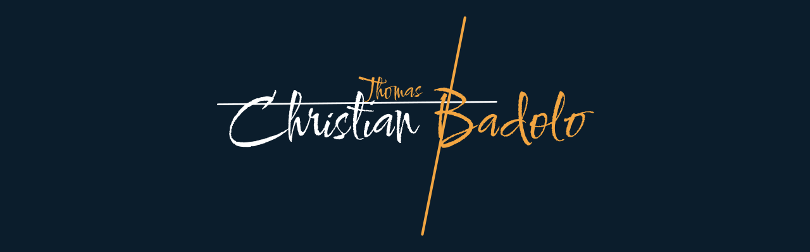

  

  <b>Je code des trucs. Beaucoup de trucs. Pas toujours utiles.</b>

  <a href="https://www.linkedin.com/in/christianthomasbadolo/"> LinkedIn</a>
  &nbsp;&nbsp;&nbsp;
  <a href="mailto:christianthomasbadolo@gmail.com"> M'écrire</a>
  &nbsp;&nbsp;&nbsp;
  <a href="https://2nbdigital.com/"> 2NB Digital</a>

 

<picture>
  <source media="(prefers-color-scheme: dark)" srcset="kit/titres/salut-sombre.svg">
  
</picture>

Je code pour le fun, pour me simplifier la vie, et surtout pour me prouver que j'en suis capable. Une motivation un peu puérile, je l'avoue. C'est exactement elle qui me fait pousser sur GitHub.

Résultat : une équation différentielle sur des tumeurs, un blind test, une maison en 3D tirée d'un plan, un CRM WhatsApp, un détecteur de joueurs de foot… et je suis loin d'avoir fini.

Le jour, je fais des trucs sérieux chez **[2NB Digital](https://2nbdigital.com/)**. Le reste du temps, je fais des trucs.

 

<picture>
  <source media="(prefers-color-scheme: dark)" srcset="kit/titres/boite-a-trucs-sombre.svg">
  
</picture>

<table>
<tr>
<td width="60"></td>
<td><b><a href="https://github.com/zenitsu93/rag-pdf-gemini">RAG sur PDF</a></b> Poser des questions à un PDF plutôt que de le lire.</td>
</tr>
<tr>
<td></td>
<td><b><a href="https://github.com/zenitsu93/gompertz-tumor-growth">Gompertz</a></b> Une équation différentielle et une tumeur. Voilà, voilà.</td>
</tr>
<tr>
<td></td>
<td><b><a href="https://github.com/zenitsu93/encore-duel-playlists">Encore</a></b> Un blind test pour savoir qui connaît vraiment ses classiques.</td>
</tr>
<tr>
<td></td>
<td><b><a href="https://github.com/zenitsu93/yolo-v8-football-player-detection">Foot + YOLO</a></b> Repérer chaque joueur sur le terrain. Même le latéral qui ne revient jamais.</td>
</tr>
<tr>
<td></td>
<td><b><a href="https://github.com/zenitsu93/detection-anomalies-salariales">Anomalies salariales</a></b> Repérer les salaires qui sortent du rang. Sans balancer personne.</td>
</tr>
<tr>
<td></td>
<td><b><a href="https://github.com/zenitsu93/amazon-books-elt-snowflake">Amazon → Snowflake</a></b> Scraper Amazon et tout ranger dans Snowflake. Le tout sous Docker.</td>
</tr>
<tr>
<td></td>
<td><b><a href="https://github.com/zenitsu93/breast-cancer-ultrasound-cnn">Échographies + CNN</a></b> Aider à repérer un cancer du sein sur échographie. AUC ≈ 0,95.</td>
</tr>
<tr>
<td></td>
<td><b><a href="https://github.com/zenitsu93/tsp-simulated-annealing">Voyageur de commerce</a></b> Trouver la tournée la plus courte en refroidissant doucement.</td>
</tr>
</table>

Le reste est dans [mes dépôts](https://github.com/zenitsu93?tab=repositories). Chacun a une description, promis.

 

<picture>
  <source media="(prefers-color-scheme: dark)" srcset="kit/titres/mode-d-emploi-sombre.svg">
  
</picture>

 &nbsp;**Force** : la vivacité. Je capte vite, je m'emballe encore plus vite. 
 &nbsp;**Méthode** : pas besoin de réinventer la roue. Je m'inspire, je trouve l'astuce, je gagne du temps. 
 &nbsp;**Manie** : que tout soit carré. Vraiment tout. 
 &nbsp;**Point faible** : les plans à long terme. J'y travaille (sans plan, évidemment). 
 &nbsp;**Carburant** : un merci sincère, et une chanson dont les paroles me parlent.

 

<picture>
  <source media="(prefers-color-scheme: dark)" srcset="kit/titres/bricole-sombre.svg">
  
</picture>

 &nbsp;**Langages** : Python, TypeScript, JavaScript, SQL 
 &nbsp;**IA et data** : PyTorch, TensorFlow, scikit-learn, LangChain, pandas 
 &nbsp;**Data engineering** : Airflow, Snowflake, Spark, Docker, PostgreSQL 
 &nbsp;**Web** : React, Next.js, Node.js, FastAPI, Django, Supabase

 

  

  Un projet, une idée bizarre, un merci : tout me va. <b><a href="mailto:christianthomasbadolo@gmail.com">christianthomasbadolo@gmail.com</a></b>
    
  Logo, icônes et couleurs : <a href="kit">mon kit de marque</a>.

