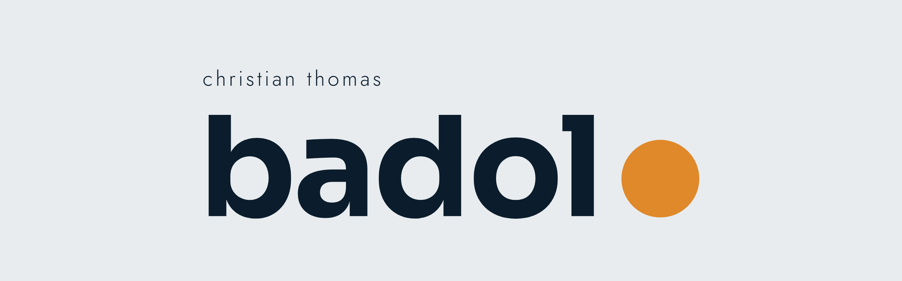
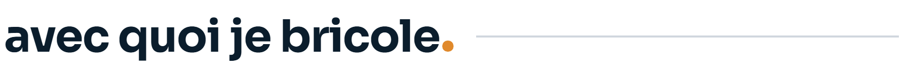
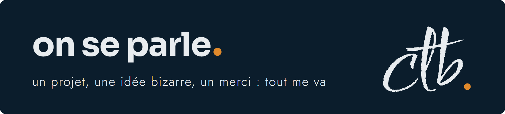

  

  <b>Je code des trucs. Beaucoup de trucs. Pas toujours utiles.</b>

  <a href="https://www.linkedin.com/in/christianthomasbadolo/"> LinkedIn</a>
  &nbsp;&nbsp;&nbsp;
  <a href="mailto:christianthomasbadolo@gmail.com"> M'écrire</a>
  &nbsp;&nbsp;&nbsp;
  <a href="https://2nbdigital.com/"> 2NB Digital</a>

 

<picture>
  <source media="(prefers-color-scheme: dark)" srcset="kit-badolo/titres/salut-sombre.png">
  
</picture>

Je code pour le fun, pour me simplifier la vie, et surtout pour me prouver que j'en suis capable. Une motivation un peu puérile, je l'avoue. C'est exactement elle qui me fait pousser sur GitHub.

Résultat : une équation différentielle sur des tumeurs, un blind test, une maison en 3D tirée d'un plan, un CRM WhatsApp, un détecteur de joueurs de foot… et je suis loin d'avoir fini.

Le jour, je fais des trucs sérieux chez **[2NB Digital](https://2nbdigital.com/)**. Le reste du temps, je fais des trucs.

 

<picture>
  <source media="(prefers-color-scheme: dark)" srcset="kit-badolo/titres/boite-a-trucs-sombre.png">
  
</picture>

<table>
<tr>
<td width="60"></td>
<td><b><a href="https://github.com/zenitsu93/FangUp">FangUp</a></b> Mon point faible, c'est les plans. Alors je construis une IA qui se souvient de mes projets et me relance au bon moment.</td>
</tr>
<tr>
<td></td>
<td><b><a href="https://github.com/zenitsu93/detection-anomalies-salariales">Anomalies salariales</a></b> Repérer les salaires qui sortent du rang, chiffrer l'ajustement, mesurer l'écart femmes-hommes. Sans balancer personne.</td>
</tr>
<tr>
<td></td>
<td><b><a href="https://github.com/zenitsu93/learny-education-chatbot">Learny</a></b> Un assistant de révision qui répond à partir de tes cours, pas de ce qu'il croit savoir.</td>
</tr>
<tr>
<td></td>
<td><b><a href="https://github.com/zenitsu93/encore-duel-playlists">Encore</a></b> Un blind test multijoueur pour savoir qui connaît vraiment ses classiques. Zéro dépendance npm.</td>
</tr>
<tr>
<td></td>
<td><b><a href="https://github.com/zenitsu93/heart-attack-api-monitoring">Modèle sous surveillance</a></b> Mettre un modèle en production, c'est bien. Savoir quand il déraille, c'est mieux.</td>
</tr>
<tr>
<td></td>
<td><b><a href="https://github.com/zenitsu93/amazon-books-elt-snowflake">Amazon → Snowflake</a></b> Scraper Amazon et tout ranger dans Snowflake, orchestré par Airflow. Le tout sous Docker.</td>
</tr>
<tr>
<td></td>
<td><b><a href="https://github.com/zenitsu93/gat-chest-xray-classification">GAT · radiographies</a></b> Des radios du thorax qui se comparent entre elles pour mieux se classer. AUC 0,88.</td>
</tr>
<tr>
<td></td>
<td><b><a href="https://github.com/zenitsu93/predictive-maintenance-optimal-transport">Maintenance prédictive</a></b> Voir venir la panne sans en avoir jamais vu une, grâce au transport optimal. Projet d'équipe à Centrale Casablanca.</td>
</tr>
</table>

**Et aussi :** [RAG sur PDF](https://github.com/zenitsu93/rag-pdf-gemini) (le préféré des visiteurs) · [Questions aux documents officiels burkinabè](https://github.com/zenitsu93/document-qa-rag) · [Gompertz](https://github.com/zenitsu93/gompertz-tumor-growth) (une équation différentielle et une tumeur, voilà, voilà) · [Foot + YOLO](https://github.com/zenitsu93/yolo-v8-football-player-detection) · [Voyageur de commerce](https://github.com/zenitsu93/tsp-simulated-annealing)

Le reste est dans [mes dépôts](https://github.com/zenitsu93?tab=repositories). Chacun a une description, promis.

 

<picture>
  <source media="(prefers-color-scheme: dark)" srcset="kit-badolo/titres/mode-d-emploi-sombre.png">
  
</picture>

 &nbsp;**Force** : la vivacité. Je capte vite, je m'emballe encore plus vite. 
 &nbsp;**Méthode** : pas besoin de réinventer la roue. Je m'inspire, je trouve l'astuce, je gagne du temps. 
 &nbsp;**Manie** : que tout soit carré. Vraiment tout. 
 &nbsp;**Point faible** : les plans à long terme. J'y travaille (sans plan, évidemment). D'où [FangUp](https://github.com/zenitsu93/FangUp). 
 &nbsp;**Carburant** : un merci sincère, et une chanson dont les paroles me parlent.

 

<picture>
  <source media="(prefers-color-scheme: dark)" srcset="kit-badolo/titres/bricole-sombre.png">
  
</picture>

 &nbsp;**Langages** : Python, TypeScript, JavaScript, SQL 
 &nbsp;**IA et data** : PyTorch, TensorFlow, scikit-learn, LangChain, pandas 
 &nbsp;**Data engineering** : Airflow, Snowflake, Spark, Docker, PostgreSQL 
 &nbsp;**Web** : React, Next.js, Node.js, FastAPI, Django, Supabase

 

  

  <b><a href="mailto:christianthomasbadolo@gmail.com">christianthomasbadolo@gmail.com</a></b>
    
  Logo, icônes et couleurs : <a href="kit-badolo">mon kit de marque</a>.

