

  

  &nbsp;
  &nbsp;
  

 

<picture>
  <source media="(prefers-color-scheme: dark)" srcset="kit-badolo/09-github/titres/salut-sombre.png">
  
</picture>

Je code pour le fun, pour me simplifier la vie, et surtout pour me prouver que j'en suis capable. C'est exactement ce qui me fait pousser sur GitHub.

Résultat : une équation différentielle sur des tumeurs, un blind test, une maison en 3D tirée d'un plan, un CRM WhatsApp, un détecteur de joueurs de foot… et je suis loin d'avoir fini.

Le jour, je conçois des produits data, IA et web chez **[2NB Digital](https://2nbdigital.com/)**. Le reste du temps, je fais des trucs.

 
 

<picture>
  <source media="(prefers-color-scheme: dark)" srcset="kit-badolo/09-github/titres/projets-sombre.png">
  
</picture>

<!-- boite-a-trucs:debut -->

  <a href="https://github.com/zenitsu93/FangUp"></a>
  <a href="https://github.com/zenitsu93/detection-anomalies-salariales"></a>
  <a href="https://github.com/zenitsu93/learny-education-chatbot"></a>
  <a href="https://github.com/zenitsu93/encore-duel-playlists"></a>
  <a href="https://github.com/zenitsu93/heart-attack-api-monitoring"></a>
  <a href="https://github.com/zenitsu93/amazon-books-elt-snowflake"></a>
  <a href="https://github.com/zenitsu93/gat-chest-xray-classification"></a>
  <a href="https://github.com/zenitsu93/predictive-maintenance-optimal-transport"></a>

<!-- boite-a-trucs:fin -->

**Et aussi :** [RAG sur PDF](https://github.com/zenitsu93/rag-pdf-gemini) · [Questions aux documents officiels burkinabè](https://github.com/zenitsu93/document-qa-rag) · [Gompertz](https://github.com/zenitsu93/gompertz-tumor-growth) · [Foot + YOLO](https://github.com/zenitsu93/yolo-v8-football-player-detection) · [Voyageur de commerce](https://github.com/zenitsu93/tsp-simulated-annealing) · [tous mes dépôts](https://github.com/zenitsu93?tab=repositories)

 

<picture>
  <source media="(prefers-color-scheme: dark)" srcset="kit-badolo/09-github/titres/mode-d-emploi-sombre.png">
  
</picture>

  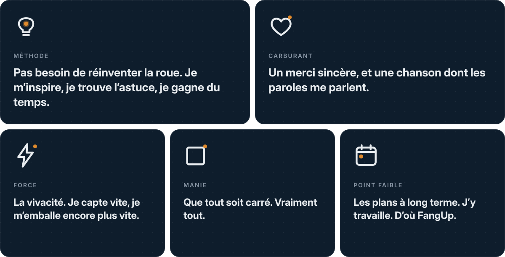

 

<picture>
  <source media="(prefers-color-scheme: dark)" srcset="kit-badolo/09-github/titres/outils-sombre.png">
  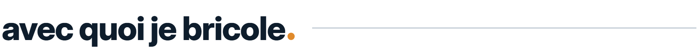
</picture>

  

 

  <a href="mailto:christianthomasbadolo@gmail.com"></a>

  <b><a href="mailto:christianthomasbadolo@gmail.com">christianthomasbadolo@gmail.com</a></b>
    
  Identité visuelle : <a href="kit-badolo">mon kit de marque</a>.

