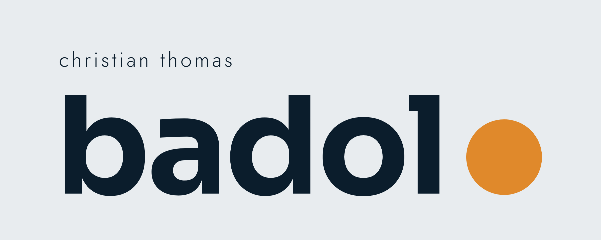
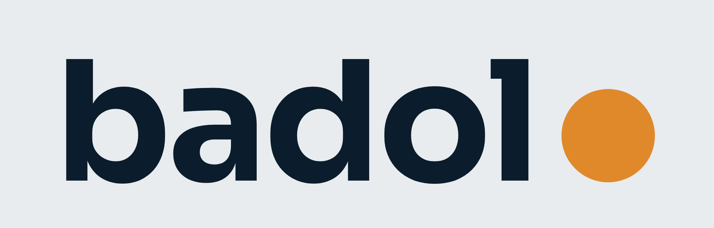
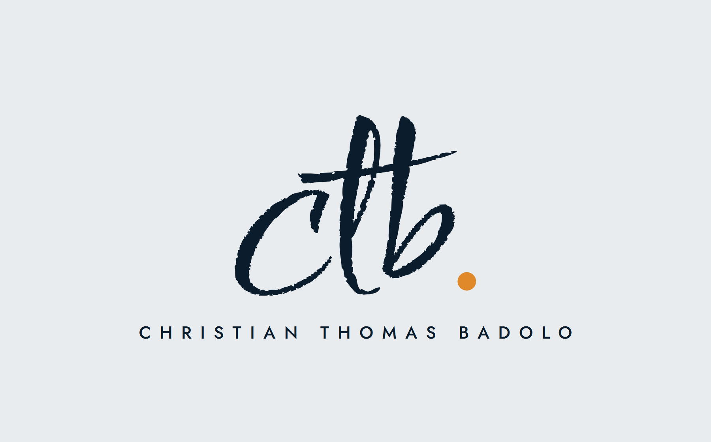
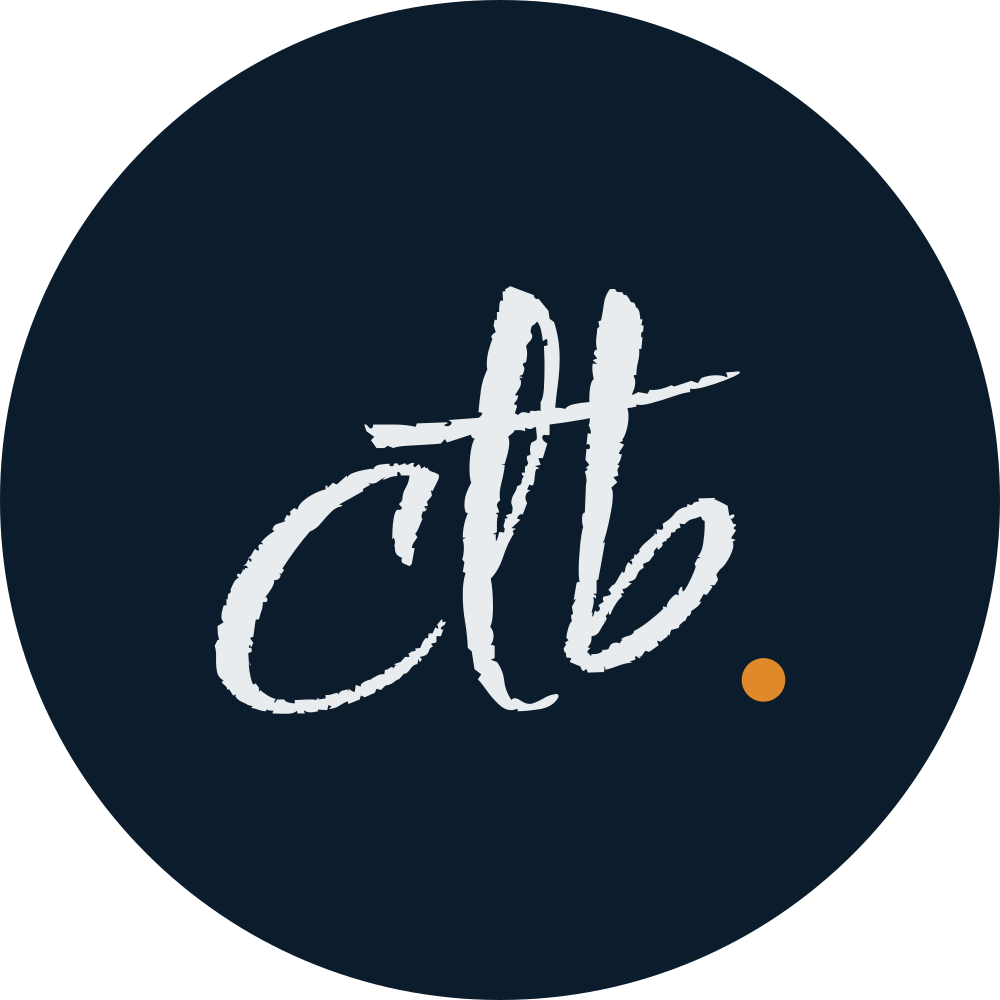

  

# Kit de marque · badol●

Le kit visuel de Christian Thomas Badolo : un mot net, **badol●**, et une signature, **ctb.**
Le point ambre est la signature du kit : c'est le dernier « o » de badolo, le point de ctb., et la fin de chaque titre.

## Logos

<table>
<tr>
<td width="380"></td>
<td><b>Principal</b> « christian thomas » au-dessus de <b>badol●</b>.  
<a href="logos/principal-fond-brume.png">fond brume</a> · <a href="logos/principal-fond-nuit.png">fond nuit</a> · <a href="logos/principal-pour-fond-clair.png">transparent, fond clair</a> · <a href="logos/principal-pour-fond-sombre.png">transparent, fond sombre</a></td>
</tr>
<tr>
<td></td>
<td><b>Court</b> <b>badol●</b> seul, pour les petits espaces.  
<a href="logos/court-fond-brume.png">fond brume</a> · <a href="logos/court-fond-nuit.png">fond nuit</a> · <a href="logos/court-pour-fond-clair.png">transparent, fond clair</a> · <a href="logos/court-pour-fond-sombre.png">transparent, fond sombre</a></td>
</tr>
<tr>
<td></td>
<td><b>Signature ctb.</b> Les initiales au pinceau et le nom complet. Pour signer : emails, documents, slides.  
<a href="logos/ctb-fond-brume.png">fond brume</a> · <a href="logos/ctb-fond-nuit.png">fond nuit</a> · <a href="logos/ctb-pour-fond-clair.png">transparent, fond clair</a> · <a href="logos/ctb-pour-fond-sombre.png">transparent, fond sombre</a></td>
</tr>
<tr>
<td></td>
<td><b>Monogramme</b> ctb. seul : photo de profil, icône d'onglet.  
<a href="logos/monogramme-ctb-nuit-rond.svg">nuit, rond</a> · <a href="logos/monogramme-ctb-nuit-carre.svg">nuit, carré</a> · <a href="logos/monogramme-ctb-brume-rond.svg">brume, rond</a> · <a href="logos/monogramme-ctb-brume-carre.svg">brume, carré</a> · <a href="logos/avatar-ctb.png">avatar PNG</a></td>
</tr>
<tr>
<td></td>
<td><b>Bannière GitHub</b> 1280 × 400, en haut du README.</td>
</tr>
</table>

## Couleurs

| | Nom | Hex | Rôle |
| --- | --- | --- | --- |
|  | Nuit | `#0B1D2C` | Texte, fonds sombres, tuiles d'icônes |
|  | Brume | `#E8ECEF` | Fond clair, texte sur fond sombre |
|  | Ambre | `#E0892B` | Le point, le détail des icônes. Jamais en aplat |
|  | Blanc | `#FFFFFF` | Respiration |
|  | Gris | `#5D6B78` | Textes secondaires |

## Typographie

| Usage | Police | Exemple |
| --- | --- | --- |
| Logo et titres | [Sora](https://fonts.google.com/specimen/Sora), gras, en minuscules | ma boîte à trucs● |
| Texte et étiquettes | [Jost](https://fonts.google.com/specimen/Jost) | christian thomas |
| Signature ctb. | [Comforter Brush](https://fonts.google.com/specimen/Comforter+Brush) | ctb. |

## Icônes

<table>
<tr>
<td align="center"> M'écrire</td>
<td align="center"> Profil</td>
<td align="center"> Site</td>
<td align="center"> Code</td>
<td align="center"> IA générative</td>
<td align="center"> Data</td>
</tr>
<tr>
<td align="center"> Maths</td>
<td align="center"> Vision</td>
<td align="center"> Musique</td>
<td align="center"> Foot</td>
<td align="center"> Anomalies</td>
<td align="center"> Itinéraire</td>
</tr>
<tr>
<td align="center"> 3D</td>
<td align="center"> Avec le cœur</td>
<td align="center"> Vivacité</td>
<td align="center"> Astuce</td>
<td align="center"> Tout carré</td>
<td align="center"> Plans</td>
</tr>
<tr>
<td align="center"> Graphes</td>
</tr>
</table>

Chaque icône existe en trois versions : [`icones/rond/`](icones/rond) (pastille nuit, lisible partout), [`icones/pour-fond-clair/`](icones/pour-fond-clair) et [`icones/pour-fond-sombre/`](icones/pour-fond-sombre). Grille de 48, trait de 3, un seul détail ambre.

## Règles

- Le point ambre termine toujours quelque chose : un mot, un titre, une signature. Jamais au milieu, un seul par élément.
- Les titres s'écrivent en minuscules et finissent par le point ambre.
- L'ambre ne sert jamais de fond.
- ctb. signe, badol● présente : la signature va en bas, le mot en haut.

## Licences

Sora, Jost et Comforter Brush sont sous licence SIL Open Font License 1.1 ([texte](OFL-ComforterBrush.txt)).
Logo et kit © 2026 Christian Thomas Badolo.
