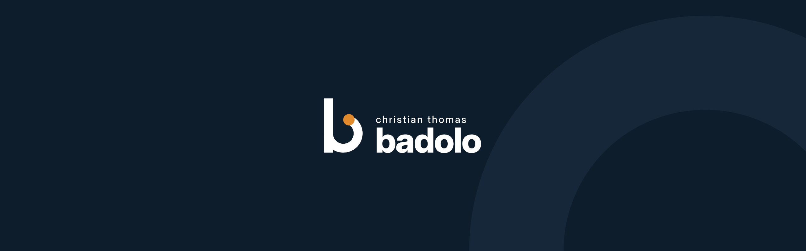
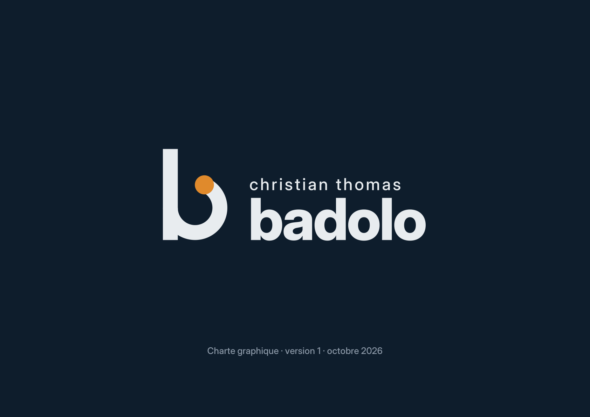
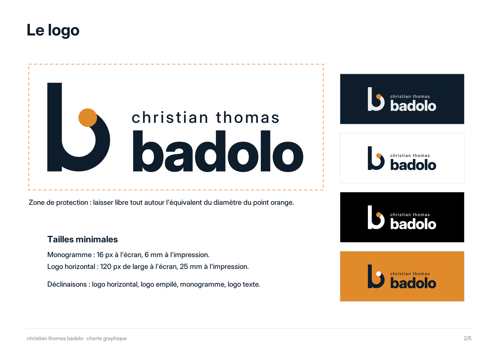
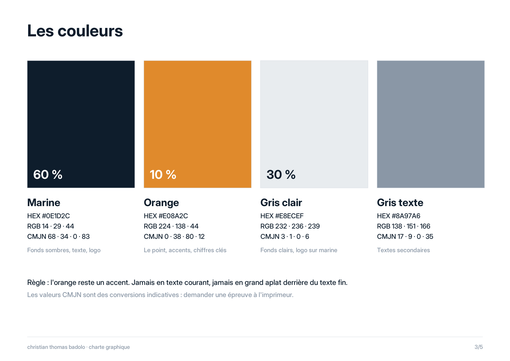
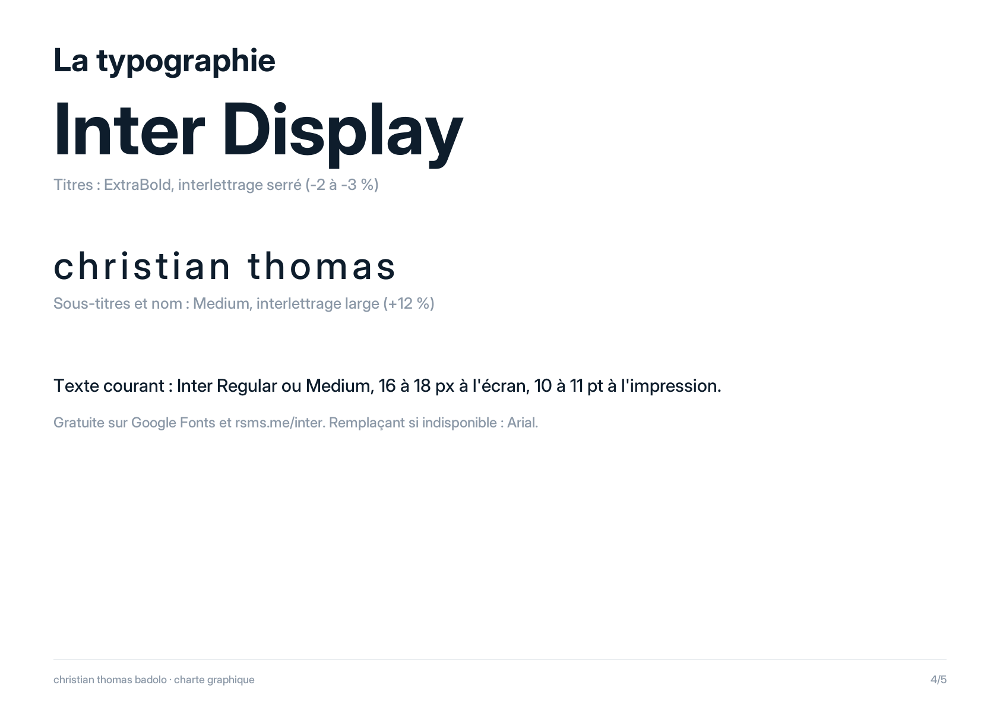
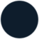
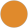
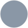

  

# Kit de marque · badolo

L'identité visuelle de Christian Thomas Badolo : un **b** construit sur un cercle, et un point orange qui ne le quitte jamais.

  

## La charte

  
  
  
  

Charte complète en PDF : [`07-charte/charte-graphique-badolo.pdf`](07-charte/charte-graphique-badolo.pdf), avec les usages à éviter en page 5.

## Couleurs

| | Nom | Hex | Part | Rôle |
| --- | --- | --- | --- | --- |
|  | Marine | `#0E1D2C` | 60 % | Fonds sombres, texte, logo |
|  | Gris clair | `#E8ECEF` | 30 % | Fonds clairs, logo sur marine |
|  | Orange | `#E08A2C` | 10 % | Le point, les accents, les chiffres clés |
|  | Gris texte | `#8A97A6` | | Textes secondaires |

L'orange reste un accent : jamais en texte courant, jamais en grand aplat derrière du texte fin.

## Typographie

**Inter Display** ExtraBold, interlettrage serré, pour les titres. **Inter** Medium, interlettrage large, pour le nom et les sous-titres. Inter Regular pour le texte courant.

## Icônes

  
  
  
  
  
  
  
  
  
  
  
  
  
  
  
  
  
  
  

Trait épais et arrondi, et comme le monogramme, un seul point orange par icône. Trois versions : [`pastille`](08-icones/pastille) (lisible partout), [`pour-fond-clair`](08-icones/pour-fond-clair), [`pour-fond-sombre`](08-icones/pour-fond-sombre).

## Le contenu du kit

| Dossier | Ce qu'on y trouve |
| --- | --- |
| [`01-logos`](01-logos) | Logo horizontal, empilé, texte, monogramme rond et carré, en SVG, PNG et PDF, dans toutes les couleurs |
| [`02-profils`](02-profils) | Avatars et cadres photo pour les réseaux |
| [`03-bannieres`](03-bannieres) | Bannières LinkedIn, X, Facebook, YouTube, Notion, aperçu de lien, couverture d'article |
| [`04-gabarits`](04-gabarits) | Posts, carrousels, citation, chiffre clé, miniature vidéo |
| [`05-outils-pro`](05-outils-pro) | Carte de visite, signature email, QR vCard, fonds de visio |
| [`06-favicons`](06-favicons) | Favicons et icônes d'application |
| [`07-charte`](07-charte) | La charte graphique |
| [`08-icones`](08-icones) | Les icônes du kit |
| [`09-github`](09-github) | Bannière, titres, boutons et monogramme animé du profil GitHub. Les images animées du profil sont générées dans [`profil`](../profil) |

Logo et kit © 2026 Christian Thomas Badolo.
