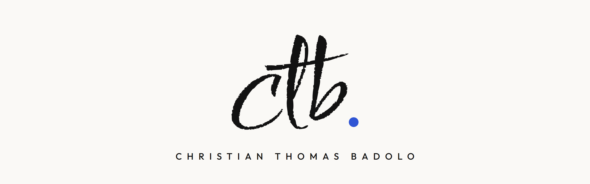
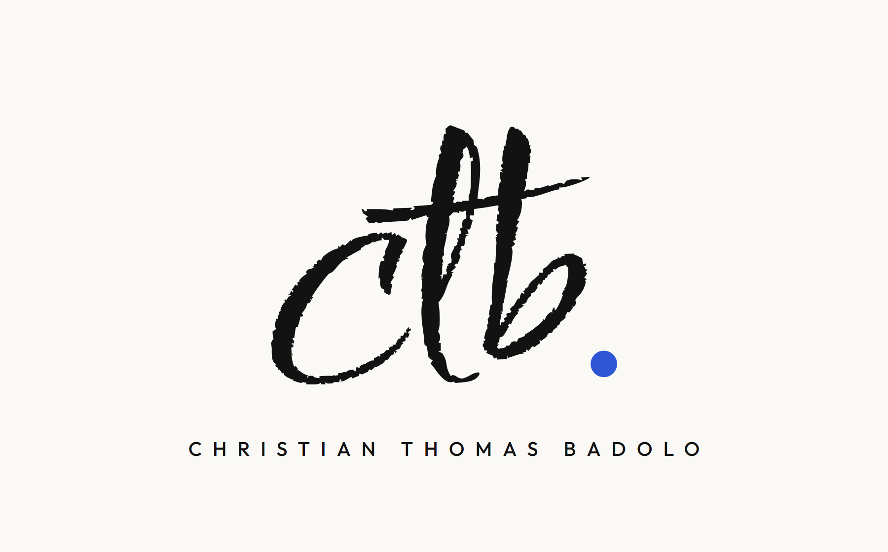
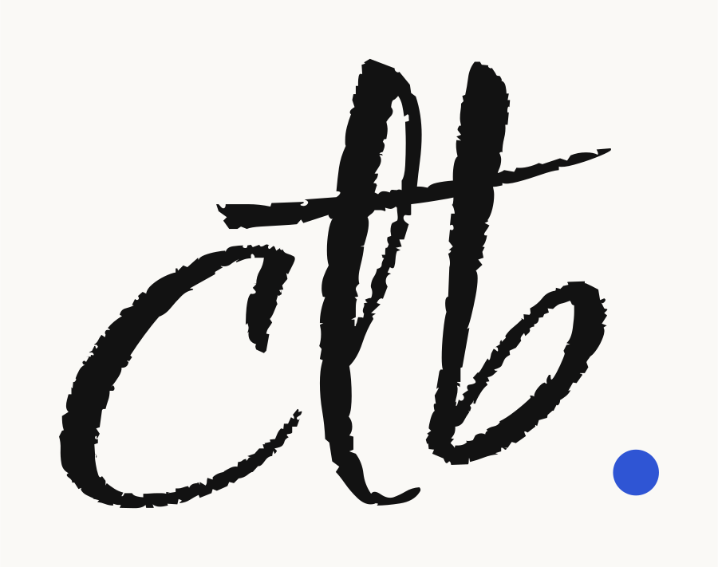
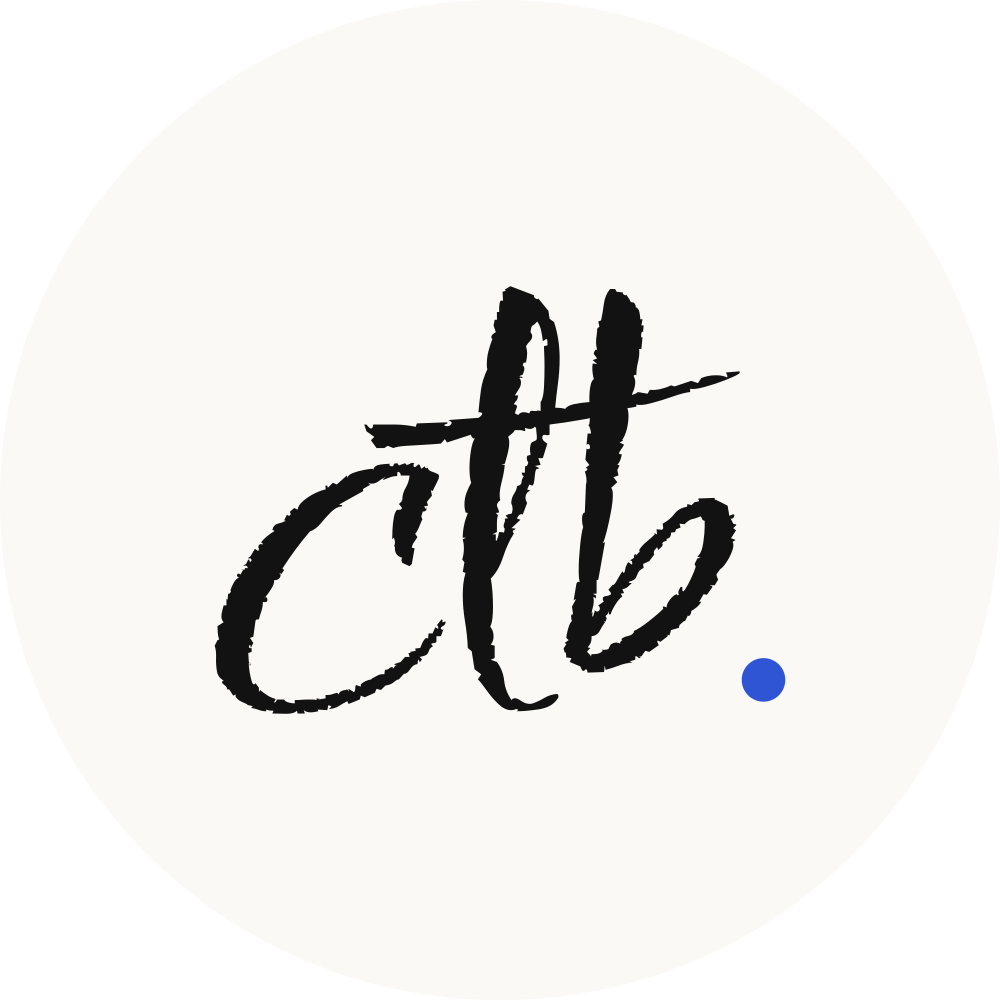
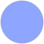
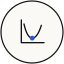
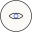
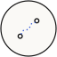
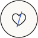

  

# Kit ctb.

La signature de Christian Thomas Badolo : les initiales au pinceau, comme écrites à la main, et un point bleu stylo.
C'est le kit pour signer : emails, documents, slides, tout ce qui demande une touche personnelle.

Tous les logos sont en SVG vectoriel : les lettres sont converties en tracés, aucune police n'est nécessaire.

## Logos

<table>
<tr>
<td width="380"></td>
<td><b>Signature</b> ctb. et le nom complet en capitales espacées.  
<a href="logos/signature-fond-papier.png">fond papier</a> · <a href="logos/signature-fond-encre.png">fond encre</a> · <a href="logos/signature-pour-fond-clair.png">transparent, fond clair</a> · <a href="logos/signature-pour-fond-sombre.png">transparent, fond sombre</a></td>
</tr>
<tr>
<td></td>
<td><b>ctb.</b> Les initiales seules, en vectoriel.  
<a href="logos/ctb-fond-papier.svg">fond papier</a> · <a href="logos/ctb-fond-encre.svg">fond encre</a> · <a href="logos/ctb-pour-fond-clair.svg">transparent, fond clair</a> · <a href="logos/ctb-pour-fond-sombre.svg">transparent, fond sombre</a></td>
</tr>
<tr>
<td></td>
<td><b>Monogramme</b> Pour une photo de profil ou une icône.  
<a href="logos/monogramme-papier-rond.svg">papier, rond</a> · <a href="logos/monogramme-papier-carre.svg">papier, carré</a> · <a href="logos/monogramme-encre-rond.svg">encre, rond</a> · <a href="logos/monogramme-encre-carre.svg">encre, carré</a> · <a href="logos/avatar-ctb.png">avatar PNG</a></td>
</tr>
<tr>
<td></td>
<td><b>Bannière</b> 1280 × 400.</td>
</tr>
</table>

## Couleurs

| | Nom | Hex | Rôle |
| --- | --- | --- | --- |
|  | Papier | `#FAF9F6` | Fond |
|  | Encre | `#121212` | Les initiales, les traits des icônes |
|  | Bleu stylo | `#2F55D4` | Le point, le détail des icônes (sur fond clair) |
|  | Bleu clair | `#8EA6FF` | Même rôle, sur fond encre |
|  | Gris | `#6B6B6B` | Textes secondaires |

## Typographie

| Usage | Police | Exemple |
| --- | --- | --- |
| Initiales | [Comforter Brush](https://fonts.google.com/specimen/Comforter+Brush) | ctb. |
| Nom et textes | [Outfit](https://fonts.google.com/specimen/Outfit), capitales espacées | C H R I S T I A N &nbsp; T H O M A S &nbsp; B A D O L O |

## Icônes

<table>
<tr>
<td align="center"> M'écrire</td>
<td align="center"> Profil</td>
<td align="center"> Site</td>
<td align="center"> Code</td>
<td align="center"> IA générative</td>
<td align="center"> Data</td>
</tr>
<tr>
<td align="center"> Maths</td>
<td align="center"> Vision</td>
<td align="center"> Musique</td>
<td align="center"> Foot</td>
<td align="center"> Anomalies</td>
<td align="center"> Itinéraire</td>
</tr>
<tr>
<td align="center"> 3D</td>
<td align="center"> Avec le cœur</td>
<td align="center"> Vivacité</td>
<td align="center"> Astuce</td>
<td align="center"> Tout carré</td>
<td align="center"> Plans</td>
</tr>
<tr>
<td align="center"> Graphes</td>
</tr>
</table>

Trait fin de 2, comme un stylo, et un seul détail bleu. Trois versions : [`icones/pastille/`](icones/pastille) (pastille papier cerclée d'encre, lisible partout), [`icones/pour-fond-clair/`](icones/pour-fond-clair) et [`icones/pour-fond-sombre/`](icones/pour-fond-sombre).

## Règles

- Le point bleu termine toujours les initiales. Il n'y en a qu'un.
- ctb. signe : on le place en bas, à la fin, comme une vraie signature.
- Le bleu stylo ne sert jamais de fond.

## Licences

Comforter Brush et Outfit sont sous licence SIL Open Font License 1.1 ([texte](OFL-ComforterBrush.txt)).
Logo et kit © 2026 Christian Thomas Badolo.
