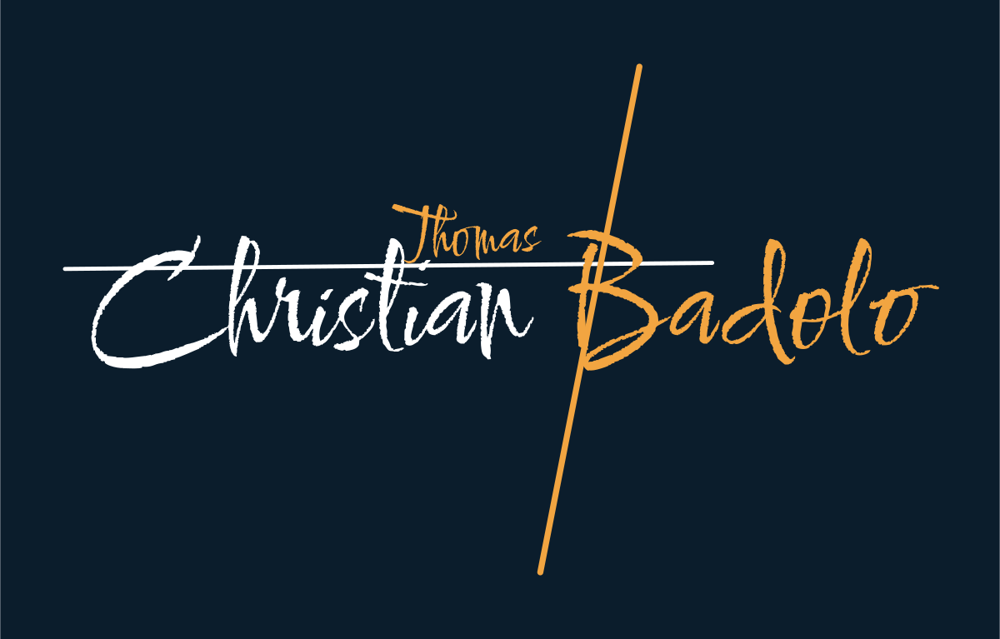
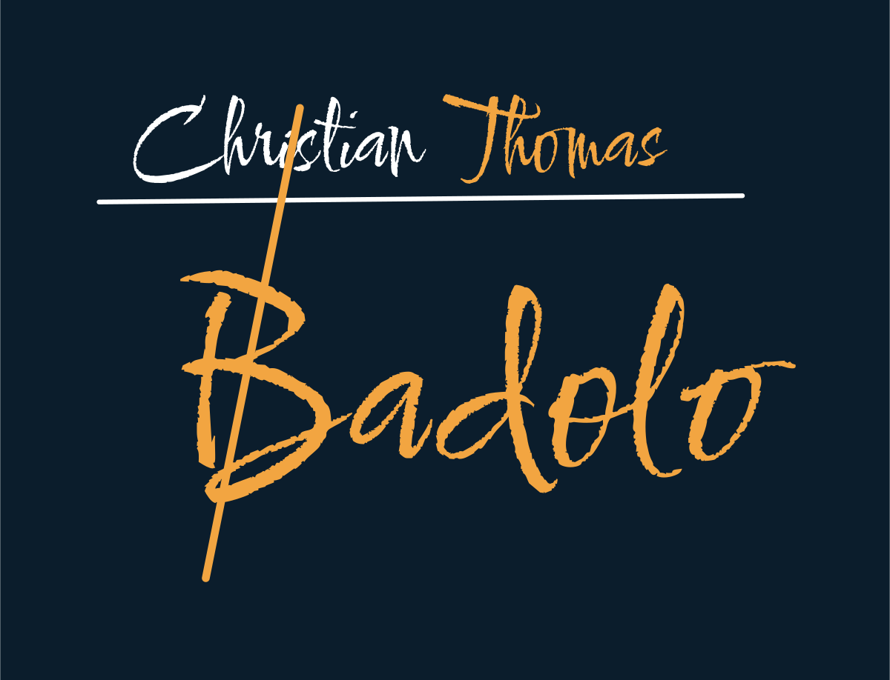
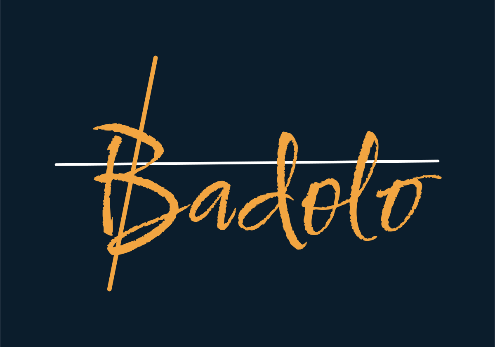
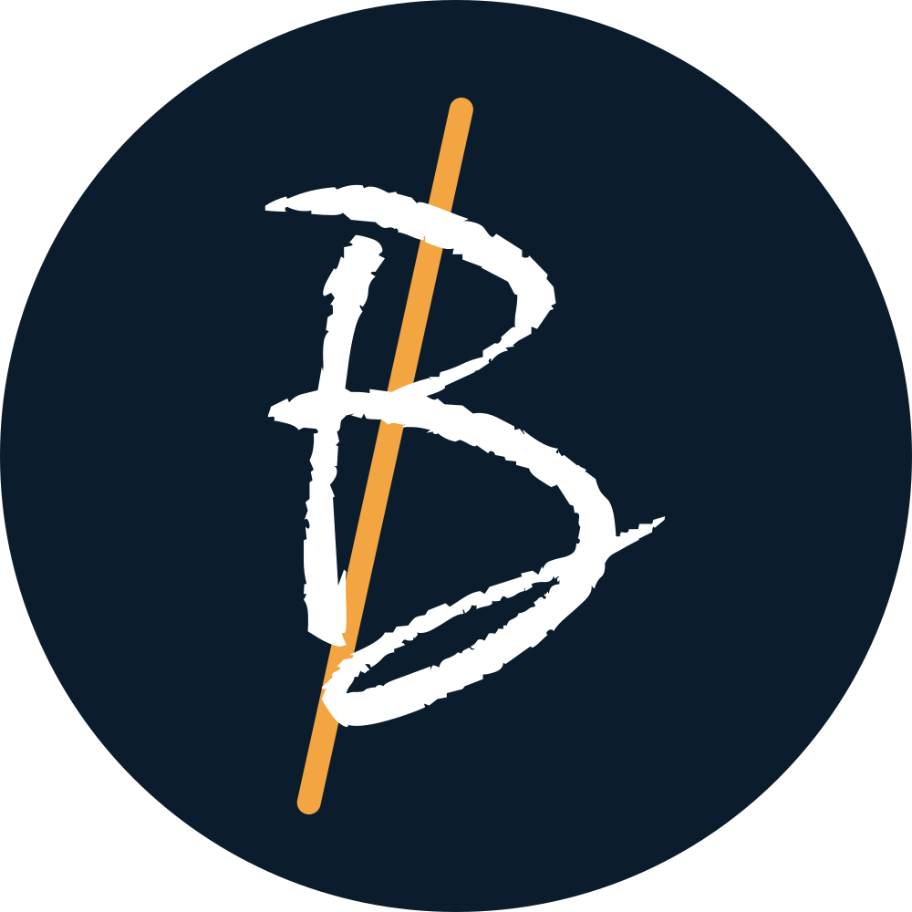

  

# Kit de marque

Le kit visuel de Christian Thomas Badolo : logos, couleurs, typographie et icônes.
Tout est en SVG vectoriel : les lettres sont converties en tracés, aucune police n'est nécessaire pour afficher les fichiers.

## Logos

<table>
<tr>
<td width="380"></td>
<td><b>Principal</b> « Christian » et « Badolo » au pinceau, « Thomas » glissé sur la ligne, le trait ambre qui barre le B.  
<a href="logos/principal-fond-nuit.svg">fond nuit</a> · <a href="logos/principal-pour-fond-sombre.svg">pour fond sombre</a> · <a href="logos/principal-pour-fond-clair.svg">pour fond clair</a></td>
</tr>
<tr>
<td></td>
<td><b>Compact</b> Pour les formats carrés : posts, vignettes, slides.  
<a href="logos/compact-fond-nuit.svg">fond nuit</a> · <a href="logos/compact-pour-fond-sombre.svg">pour fond sombre</a> · <a href="logos/compact-pour-fond-clair.svg">pour fond clair</a></td>
</tr>
<tr>
<td></td>
<td><b>Court</b> Pour les petits espaces, quand le nom complet ne tient pas.  
<a href="logos/court-fond-nuit.svg">fond nuit</a> · <a href="logos/court-pour-fond-sombre.svg">pour fond sombre</a> · <a href="logos/court-pour-fond-clair.svg">pour fond clair</a></td>
</tr>
<tr>
<td></td>
<td><b>Monogramme</b> Le B barré : photo de profil, icône d'onglet, tampon.  
<a href="logos/monogramme-carre.svg">carré</a> · <a href="logos/monogramme-rond.svg">rond</a></td>
</tr>
<tr>
<td></td>
<td><b>Bannière GitHub</b> 1280 × 400, en haut du README.  
<a href="logos/banniere-github.svg">banniere-github.svg</a></td>
</tr>
</table>

## Couleurs

| | Nom | Hex | Rôle |
| --- | --- | --- | --- |
|  | Nuit | `#0B1D2C` | Fond principal, tuiles |
|  | Blanc | `#FFFFFF` | « Christian », la ligne, les traits des icônes |
|  | Ambre | `#F2A541` | « Thomas », « Badolo », le trait, le détail des icônes (sur fond foncé) |
|  | Ambre soutenu | `#D9822B` | Même rôle que l'ambre, sur fond clair |
|  | Brume | `#8FA3B5` | Textes secondaires, légendes |

## Typographie

| Usage | Police | Exemple |
| --- | --- | --- |
| Titres | [Comforter Brush](https://fonts.google.com/specimen/Comforter+Brush) | Ma boîte à trucs |
| Texte | [Outfit](https://fonts.google.com/specimen/Outfit) | Je code pour le fun, pour me simplifier la vie. |
| Étiquettes | Outfit, capitales espacées | C H R I S T I A N &nbsp; T H O M A S &nbsp; B A D O L O |

Les titres de section du profil sont dans [`titres/`](titres), chacun en version claire et sombre.

## Icônes

<table>
<tr>
<td align="center"> M'écrire</td>
<td align="center"> Profil</td>
<td align="center"> Site</td>
<td align="center"> Code</td>
<td align="center"> IA générative</td>
<td align="center"> Data</td>
</tr>
<tr>
<td align="center"> Maths</td>
<td align="center"> Vision</td>
<td align="center"> Musique</td>
<td align="center"> Foot</td>
<td align="center"> Anomalies</td>
<td align="center"> Itinéraire</td>
</tr>
<tr>
<td align="center"> 3D</td>
<td align="center"> Avec le cœur</td>
<td align="center"> Vivacité</td>
<td align="center"> Astuce</td>
<td align="center"> Tout carré</td>
<td align="center"> Plans</td>
</tr>
<tr>
<td align="center"> Graphes</td>
</tr>
</table>

Chaque icône existe en trois versions :

- [`icones/tuile/`](icones/tuile) : sur une tuile bleu nuit, lisible sur n'importe quel fond ;
- [`icones/pour-fond-sombre/`](icones/pour-fond-sombre) : traits blancs, détail ambre, fond transparent ;
- [`icones/pour-fond-clair/`](icones/pour-fond-clair) : traits nuit, détail ambre soutenu, fond transparent.

Grille de 48, trait de 3, bouts arrondis, un seul détail ambre par icône.

## Règles

- Le trait ambre barre toujours le B.
- Un seul détail ambre par icône, jamais plus.
- Sur fond clair, l'ambre devient l'ambre soutenu `#D9822B`.
- Laisser de l'air autour du logo : au moins la hauteur de « Thomas » de chaque côté.

## Licences

La police Comforter Brush est sous licence SIL Open Font License 1.1 ([texte](OFL-ComforterBrush.txt)).
Logo et kit © 2026 Christian Thomas Badolo.
